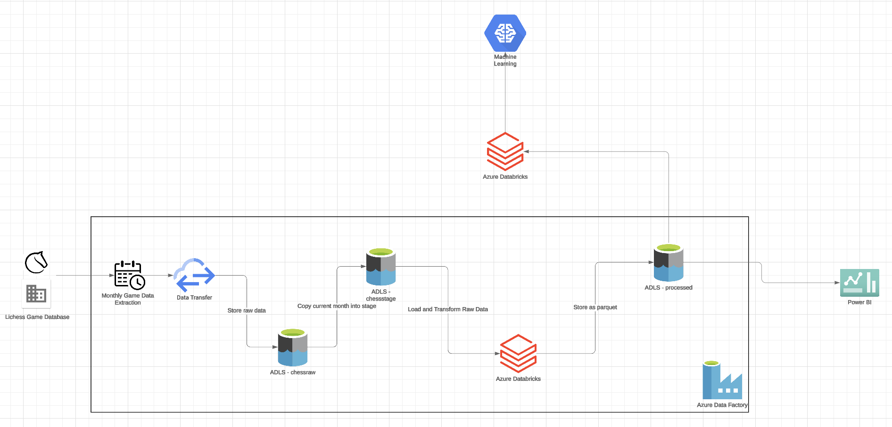
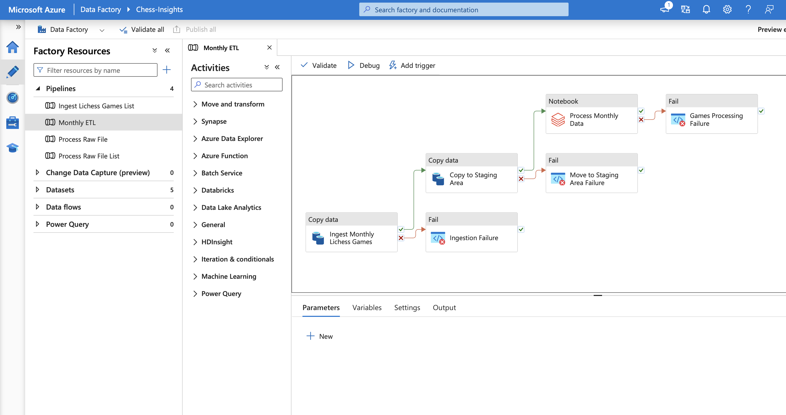
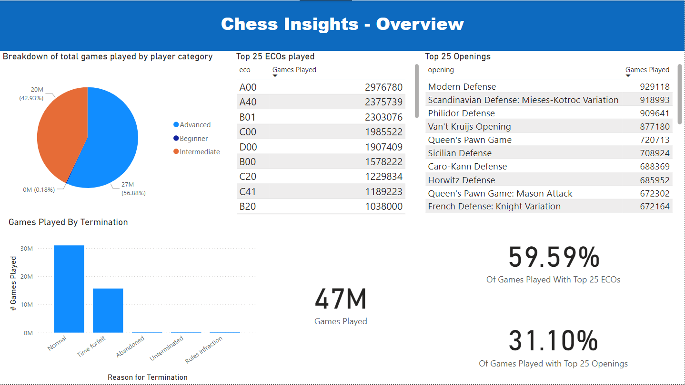
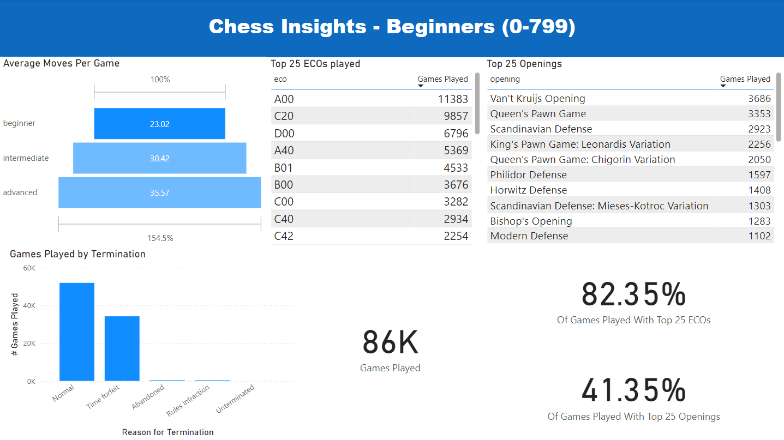
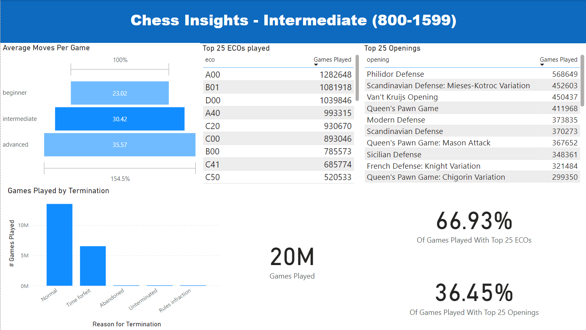
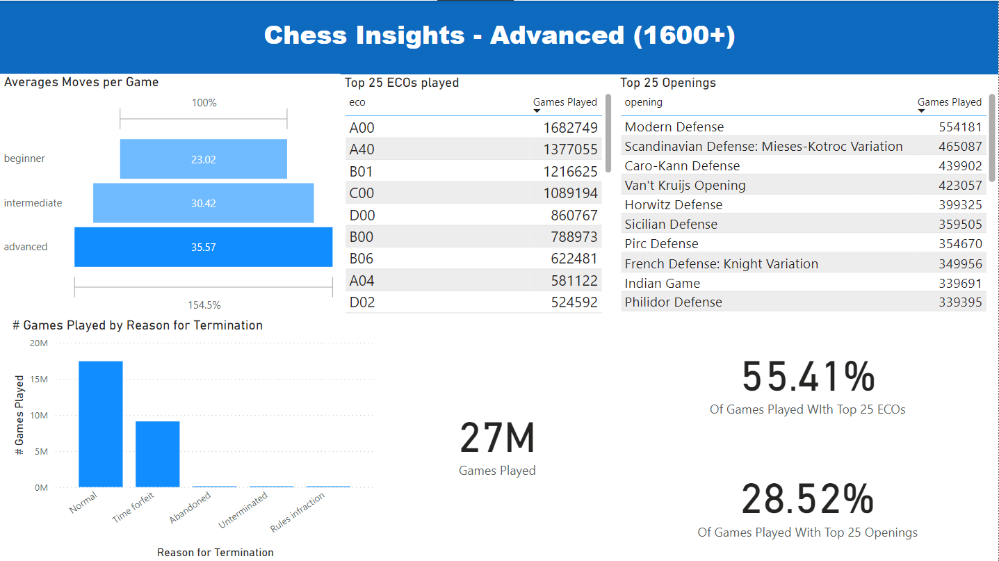

# Intro
For the last 8 months I have been learning and playing chess. Along my journey I hit a plateau around 800 ELO, leading me to question what the next steps are to get better. Among these steps were studying and practicing openings. Of which there are many, with many variations within each. Becoming strong against the plethora of openings can be difficult and takes a lot of time. Thus, I sought out a way to determine which openings I can focus on. This is when I discovered the lichess game database, containing a file of the lichess games for each month. In recent years, each month averages around 30GB compressed PGN data. After discovering these games, I decided to build a data pipeline that can ingest, transform, and store these games in order to draw insights from the data.

The methods section talks about the process I took from start to end. Introducing the tech stack I used, tools for design, and things I considered along the way.

The problems sections dives into the many issues I faced along the way, attempting to identify what the problem was, why it happened, and what I could have done differently (or actually changed).

Finally I display the dashboard I created, and explain what conclusions I drew from the data and report.

This project was done heavily utilizing Azure services and the free \$200 credit given when signing up. I ended up using about $160 of this amount, with the majority coming from the Databricks runs.

 * Diagram of the monthly ETL pipeline

 

 * ADF monthly ETL pipeline

 

For now I stopped with drawing insights via a dashboard. In the future, I may continue with this project by utilizing the data for training machine learning models.

# Methods
I started out by figuring out what questions I wanted to answer and insights I wanted to draw. Then I used these to influence the design of my pipeline. The main things I wanted to learn were the following

 * What are the most popular openings played?
 * Which openings have the highest success rate?
 * What is the volume of games like?
 * How do these games tend to end?

My goal being to analyze each player category, along with comparing the analysis between categories. I wanted to discover how I can best spend my time studying openings, based on popularity and success rate.

Due to the size of the monthly data (30GB compressed, 7x larger decompressed), I had to utilize efficient ways of storing (both raw and transformed), processing, and analyzing the data. 

## Storing The Data
I created three containers within my storage account (raw, stage, processed)

### Raw data

| filename    | Size (GB) |
| :------------: | :------------: |
| lichess_standard_db_rated_2020-01.pgn.zst  | 13.7 |
| lichess_standard_db_rated_2020-02.pgn.zst  | 12.9 |
| ... | |
| lichess_standard_db_rated_2024-08.pgn.zst  | 30 |

The raw data was ingested using data factory and stored into the raw container as .pgn.zst files. To stick within the free tier, I chose to only run the ETL pipeline on data from 2020 to August 2024.

### Staging Data
The staging area holds a single month file at a time, after being stored in raw, it is copied over into the staging area to be used by the Databricks notebook.

### Processed Data
The processed data is stored in Parquet format. This has a number of benefits compared to other methods, such PostgreSQL, or CSV.

 * Parquet format reduces the size of the data due to being a compressed format (210GB decompressed pgn is around 60GB in parquet after processing).
 * Parquet is column-based, allowing for efficient analytical processes (even SQL by using Azure Synapse SQL pools).
 * Parquet is efficient for reading / querying time

Along with the parquet games file, another file is created that has extracted information from the game files, allowing me to create a report without worrying about loading lots of data. The file has information about how many games were played by opening, eco, time control, termination reason, separated by player class.

## Transformations
To process the data, data factory calls a databricks notebook, passing the name of the file as a parameter. Databricks has the needed blob containers mounted to allow for local-like file access to the raw data. Due to the size of the data, loading the entire file in was not possible. I wanted to maintain a cost-effective pipeline, so I used a low-memory compute (16GB 4 workers) but implemented a solution that involved streaming the compressed file in, creating a batch of games, then processing and storing the games in parquet. There were a few cases of handling missing values and type conversions to facilitate my analytics process.

## Analytics

| Class    | ELO |
| :------------: | :-------: |
| Beginner  | 0-799    |
| Intermediate |   800-1599   |
| Advanced    | 1600+    |

I chose to use Power BI for dashboard creation. I chose this because it is easy to use, I have experience prior experience, it is widely used in industry, and it is free for my use case.

My dashboard consists of 4 pages. A summary page for all games and  a similar page for each player class.

# Conclusion

From the dashboard

 * The moves per game clearly inceases when going up in elo category. It is expected for more experienced players to tend to have games that last longer.
 
 * There is a clear dropoff in the percentage of games played with the top 25 ECOs and openings. This was not a surprise since as players gain more experience, they are more likely to play a wider range of openings.
 
 * While the difference between categories was not surprising, I was interested to see that for beginners, only 41% of the games were played with the top 25 openings. This indicates the difficulty of learning openings, even at the beginner level.
 
 * Comparing the graphs of games played by reason for termination, the beginner elo range has a noticeably higher proportion of games ending in time forfeit. This makes sense that beginners would struggle more with using their time effectively. This means that utilizing time effectively could boost win rates by itself.

There is a lot more I could do with this data. I hope to use what I've learned to continue to improve my chess skills, and possibly come back later to perform further analysis.

# Problems I Encountered
The size of the data posed problems for a personal project. To ingest the data, downloading the data manually and then uploading to a blob storage was not feasible due to the size of the data. Additionally, finding a way to upload even one of the 30GB files was difficult. Trying to upload it on the portal UI had the issue of logging me out after ~5 min, and you have to stay there to for the upload to continue. Using the storage explorer was possible, but uploading takes a very long time and was not ideal for the size of data I had. What I decided to do was to create a ForEach pipeline in ADF that took a list of files and called a copy data activity for each that used an HTTP linked service as source and blob container (raw data) as the sink.

Another issue with the size of the data was processing it. Loading all the data into memory would be difficult with the compressed data, but even moreso with the size of the data with decompressed (~7 times larger). Even if utilizing a high memory compute were feasible with my resources, it would be hard to find one with enough memory. To navigate this, I decided to employ stream decompression and batch processing and writing the games. This way I could read chunks of the compressed file until I get a batch, process it, write it, and free the memory.

Lastly, with the size of the data, many hundreds of millions of games, a SQL database would not be easy to utilize for storing and querying. 

Even simple things such as setting up the ability to read files in ADLS from databricks was difficult. There were a few ways of doing this, but what I chose to do was to mount the two needed containers (stage area & processed) onto databricks. This required setting up a service account with the storage blob contributer role. Then you can take the credentials and use them as configuration for mounting {insert img}. 

abfss:// is the ADLS file system, when mounting, you use a path such as /mnt/stage/, but when referencing the path in the code to open files, you need to use the /dbfs prefix e.g. /dbfs/mnt/stage/  --- If you don't do this, you will get FileNotFoundError

Creating a dictionary of the config and passing that in for some reason fixed the error of "Unsupported file system abfss://", prior to that I hard coded the config inside the function call.

